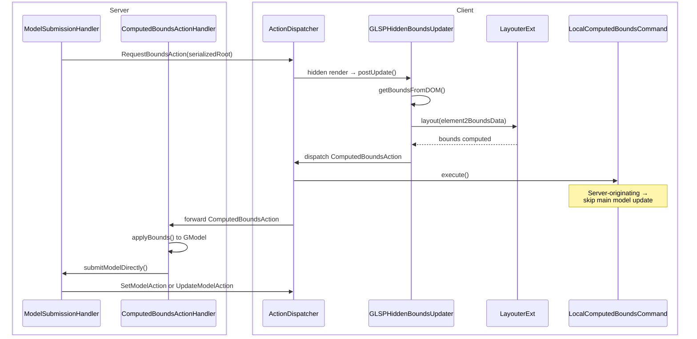
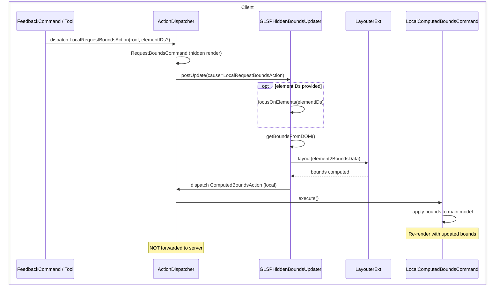
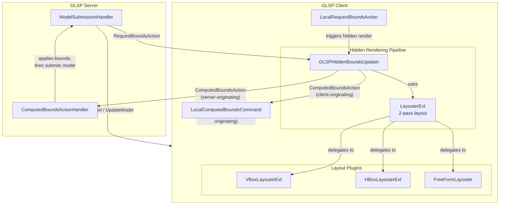

<!--
topic: client-side-layout-flow
scope: architecture
entry-points:
  - packages/client/src/features/bounds/glsp-hidden-bounds-updater.ts
  - packages/client/src/features/bounds/local-bounds.ts
  - packages/protocol/src/action-protocol/model-layout.ts
related:
  - ./index.md
last-updated: 2026-03-04
-->

# Client Layout Flow

## Overview

GLSP uses a **hidden rendering round-trip** to compute the visual bounds (position and size) of diagram elements. Because element dimensions depend on CSS styles, fonts, and SVG rendering, the client must measure elements in the actual browser DOM. The server cannot know these dimensions on its own.

Two entry points trigger this flow:

-   **Server-initiated:** The server dispatches a `RequestBoundsAction` containing a serialized model. The client renders it invisibly, measures bounds, and responds with a `ComputedBoundsAction`. The server then applies the bounds and sends the final model update.
-   **Client-initiated:** The client dispatches a `LocalRequestBoundsAction` when layout recomputation is needed for client-side feedback. This triggers the same hidden rendering pipeline but the results stay local — they are never sent to the server.

## Key Concepts

-   **Hidden rendering**: Sprotty renders the model into an invisible SVG DOM to measure actual element sizes without affecting the visible diagram.
-   **`needsClientLayout`**: A boolean flag on the server's `DiagramConfiguration` that controls whether the server requests client-side bounds computation during model updates.
-   **Two-pass layout**: The client-side layouter runs two passes — first child-to-parent (compute preferred sizes), then parent-to-children (apply grab/alignment rules).
-   **`focusOnElements`**: An optimization for local bounds computation that limits measurement to only the affected elements and their descendants, avoiding a full model relayout during interactive feedback.

## How It Works

### Server-Initiated Bounds Computation

This is the primary flow during model loading and after server-side operations.

**Step-by-step:**

1. An operation completes on the server (or the client sends `RequestModelAction` on initial load).
2. The server's `ModelSubmissionHandler.submitModel()` refreshes the `GModel` from the source model. If `needsClientLayout` is `true`, the handler serializes the `GModel` and dispatches `RequestBoundsAction` containing the serialized root.
3. On the client, sprotty's `RequestBoundsCommand` (a `HiddenCommand`) renders the model into an invisible SVG container.
4. After the hidden DOM is rendered, `GLSPHiddenBoundsUpdater.postUpdate()` calls `getBoundsFromDOM()` to extract actual dimensions from the SVG elements, then runs `layouter.layout()` (the two-pass `LayouterExt`) to compute container layouts.
5. The updater collects `ElementAndBounds`, `ElementAndAlignment`, `ElementAndRoutingPoints`, and `ElementAndLayoutData`, then dispatches a `ComputedBoundsAction`.
6. `LocalComputedBoundsCommand` receives the action. Since the action originates from the server, the command skips updating the main model — the real update will come from the server.
7. The `ComputedBoundsAction` is forwarded to the server. The server's `ComputedBoundsActionHandler` applies bounds/alignments/routes to the `GModel`, optionally runs server-side layout via `LayoutEngine`, and sends the final model update to the client.

### Client-Initiated Bounds Computation (Local Feedback)

This flow is used during interactive operations like resizing or adding template elements, that require layout recalculation for dynamic feedback.

**Step-by-step:**

1. A client-side component (e.g., a `FeedbackCommand` or tool) dispatches a `LocalRequestBoundsAction`, optionally specifying `elementIDs` to scope the computation.
2. The same hidden rendering pipeline as the server-initiated flow runs. `GLSPHiddenBoundsUpdater.postUpdate()` detects the `LocalRequestBoundsAction` and — if `elementIDs` are provided — calls `focusOnElements()` to limit measurement to only the specified elements and their descendants.
3. After layout computation, the updater marks the resulting `ComputedBoundsAction` as local, preventing it from being forwarded to the server.
4. `LocalComputedBoundsCommand` detects the local action and — if `needsClientLayout` is `true` — applies the computed bounds to the main model via `ComputedBoundsApplicator`, causing a visible re-render with the updated bounds.

## Architecture Diagram

## Key Files

| File                                                                | Responsibility                                                               |
| ------------------------------------------------------------------- | ---------------------------------------------------------------------------- |
| `packages/protocol/src/action-protocol/model-layout.ts`             | `RequestBoundsAction`, `ComputedBoundsAction`, `LayoutOperation` definitions |
| `packages/client/src/features/bounds/glsp-hidden-bounds-updater.ts` | DOM measurement engine, dispatches `ComputedBoundsAction`                    |
| `packages/client/src/features/bounds/local-bounds.ts`               | `LocalRequestBoundsAction`, `LocalComputedBoundsCommand`                     |
| `packages/client/src/features/bounds/layouter.ts`                   | Two-pass layout orchestrator (`LayouterExt`, `StatefulLayouterExt`)          |
| `packages/client/src/features/bounds/vbox-layout.ts`                | Vertical box layout with hGrab/vGrab                                         |
| `packages/client/src/features/bounds/hbox-layout.ts`                | Horizontal box layout with hGrab/vGrab                                       |
| `packages/client/src/features/bounds/freeform-layout.ts`            | Free-form (absolute positioning) layout                                      |
| `packages/client/src/features/bounds/layout-data.ts`                | `LayoutAware` interface for computed dimensions and layout metadata          |
| `packages/client/src/features/bounds/bounds-module.ts`              | DI module registering all bounds/layout services                             |

## Design Decisions

**Why hidden rendering?** Element dimensions depend on CSS styles, font metrics, and SVG rendering that only the browser can compute. The server has no DOM and cannot predict these sizes. Hidden rendering provides accurate measurements without affecting the visible diagram.

**Why two layout passes?** A single pass cannot resolve parent-child size dependencies when children use `hGrab`/`vGrab` to fill remaining space. Pass 1 computes the intrinsic preferred size of each container (bottom-up). Pass 2 distributes remaining space using the now-known parent dimensions (top-down).

**Why `LocalRequestBoundsAction`?** During interactive feedback (e.g., live resize), sending bounds to the server and waiting for a response would cause unacceptable latency. `LocalRequestBoundsAction` reuses the same hidden rendering pipeline but keeps results client-local, providing instant visual feedback.

**Why `focusOnElements`?** During feedback, only a small subset of elements have changed bounds. Computing layout for the entire model would be wasteful. The `focusOnElements` optimization filters measurement to only the affected elements and their descendants.

## Related Topics

-   [Layout Configuration](./layout-configuration.md) — Layout registration, default layouts, and model configuration
