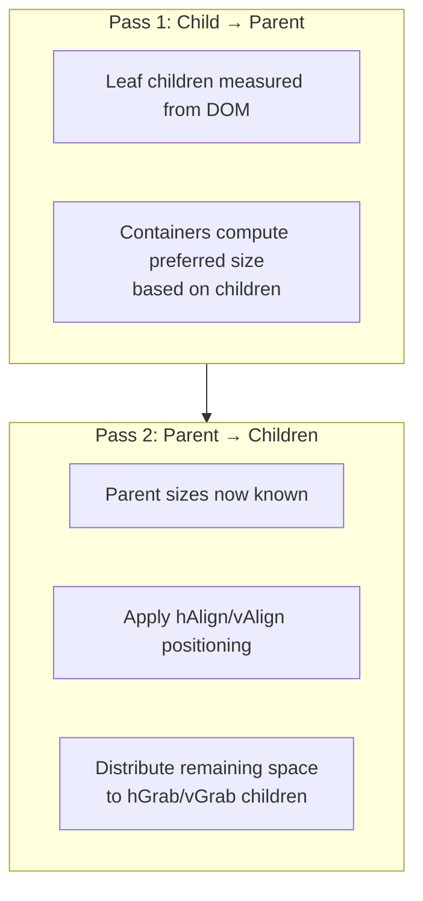

<!--
topic: layout-configuration
scope: concept
entry-points:
  - packages/client/src/features/bounds/bounds-module.ts
  - packages/client/src/features/bounds/vbox-layout.ts
  - packages/client/src/features/bounds/hbox-layout.ts
  - packages/client/src/features/bounds/freeform-layout.ts
  - packages/glsp-sprotty/src/layout-override.ts
related:
  - ./client-layout-flow.md
  - ./index.md
last-updated: 2026-03-04
-->

# Layout Configuration

## Overview

GLSP provides a **pluggable layout system** that controls how container elements arrange their children. Not all graphical elements participate in layout — only specific layout-aware elements are considered by the layout engine (see [Layout features](#key-concepts) below).

Each layout-aware container element declares a `layout` kind (e.g., `'vbox'`, `'hbox'`, `'freeform'`) and optional `layoutOptions` that fine-tune spacing, alignment, and size behavior. The client resolves the layout kind to a registered `ILayout` implementation via a `LayoutRegistry` and executes the layout during the hidden bounds computation pass.

Three layout implementations ship by default: **VBox** (vertical stacking), **HBox** (horizontal stacking), and **FreeForm** (absolute positioning).

## Key Concepts

-   **Layout features (opt-in)**: Not all graphical elements participate in layout. An element must provide the **`layoutContainerFeature`** to act as a layout container, and/or the **`layoutableChildFeature`** to be positioned by a parent layout.

    | Element | `layoutContainerFeature` | `layoutableChildFeature` |
    |---------|:------------------------:|:------------------------:|
    | `GNode` | yes | no |
    | `GCompartment` | yes | yes |
    | `GLabel` | no | yes |
    | `GPort` | no | no |
    | `GEdge` | no | no |

    Custom model classes must provide these features to participate in layout.

-   **Layout kind**: A string identifier (e.g., `'vbox'`) stored on a container element's `layout` property. The `LayoutRegistry` maps layout kinds to `ILayout` implementations.
-   **Layout options**: A key-value `Args` object (`{ [key: string]: JsonPrimitive }`) stored on an element's `layoutOptions` property. Layout options control padding, alignment, gaps, grab behavior, and preferred sizes. Options on a container apply to all children unless overridden by child-level options.
-   **`LayoutContainer`**: An interface for elements that have both a `layout` kind and children. The layouter only processes elements that satisfy `isLayoutContainer()` — which checks for the `layoutContainerFeature` flag, the presence of a `layout` property, and a non-empty children array.
-   **`ILayout`**: The interface that layout implementations must satisfy. Each `ILayout` receives a container and a `StatefulLayouter` and computes bounds for the container and its children.
-   **`LayoutRegistry`**: An `InstanceRegistry<ILayout>` that maps layout kind strings to `ILayout` instances. Populated at DI container initialization via `configureLayout()` calls.
-   **`Layouter`**: The layout engine (`packages/client/src/features/bounds/layouter.ts`) that delegates to the two-pass `StatefulLayouter` for layout computation.
-   **`orderAgnostic`**: A boolean flag on `ILayout` indicating whether the layout result is independent of child order. `FreeFormLayouter` is order-agnostic; `VBoxLayouter` and `HBoxLayouter` are not.

## How It Works

### Layout Registration

Layouts are registered via DI modules using the `configureLayout()` utility, which binds a layout kind string to an `ILayout` implementation. The three default layouts are registered in the `boundsModule` (`packages/client/src/features/bounds/bounds-module.ts:55`):

```typescript
configureLayout(context, VBoxLayouter.KIND, VBoxLayouter); // 'vbox'
```

Custom layouts can be registered in the same way within a `FeatureModule`.

### Layout Resolution at Runtime

During the hidden bounds computation pass (see [Client Layout Flow](./client-layout-flow.md)), the `StatefulLayouter` iterates over all `LayoutContainer` elements and resolves each container's `layout` kind to an `ILayout` via the registry:

```typescript
// layouter.ts:125
const layout = this.layoutRegistry.get(element.layout);
if (layout) {
    layout.layout(element, this);
}
```

### Two-Pass Layout Algorithm

The `StatefulLayouter` (`packages/client/src/features/bounds/layouter.ts:44`) executes layout in two passes:

**Pass 1 — Child-to-parent (preferred sizes):** Iterates all `LayoutContainer` elements from children upward. Each layout computes the intrinsic/preferred size of the container based on its children's rendered sizes. Container bounds data is cleared before this pass so layouts work from fresh measurements.

**Pass 2 — Parent-to-children (space distribution):** Iterates all `LayoutContainer` elements again. Now that parent sizes are known, layouts apply alignment rules (`hAlign`/`vAlign`) and distribute remaining space to children with `hGrab`/`vGrab` enabled.



## Default Layouts

All layouts share a set of **base options**. The VBox and HBox layouts extend these with additional options for alignment, gaps, grab behavior, and preferred sizing.

### Base Options

These options are supported by all three default layouts:

| Option | Type | Default (VBox/HBox) | Default (FreeForm) | Description |
|--------|------|:-------------------:|:------------------:|-------------|
| `resizeContainer` | `boolean` | `true` | `true` | Container resizes to fit children |
| `paddingTop` | `number` | `5` | `0` | Top padding inside container |
| `paddingBottom` | `number` | `5` | `0` | Bottom padding inside container |
| `paddingLeft` | `number` | `5` | `0` | Left padding inside container |
| `paddingRight` | `number` | `5` | `0` | Right padding inside container |
| `paddingFactor` | `number` | `1` | `1` | Multiplier applied to padding space |
| `minWidth` | `number` | `0` | `0` | Minimum container width |
| `minHeight` | `number` | `0` | `0` | Minimum container height |

### VBox Layout (`'vbox'`)

Stacks children **vertically** from top to bottom. Implemented by `VBoxLayouter` (`packages/client/src/features/bounds/vbox-layout.ts:46`).

**Additional options:**

| Option | Type | Default | Description |
|--------|------|---------|-------------|
| `vGap` | `number` | `1` | Vertical gap between children |
| `hAlign` | `string` | `'center'` | Horizontal alignment: `'left'`, `'center'`, `'right'` |
| `hGrab` | `boolean` | `false` | Child stretches to fill container width |
| `vGrab` | `boolean` | `false` | Child stretches to fill remaining vertical space |
| `prefWidth` | `number \| null` | `null` | Preferred container width (overrides computed) |
| `prefHeight` | `number \| null` | `null` | Preferred container height (overrides computed) |

**Behavior:** When `hGrab` is `true` on a child, the child's width is set to the container's inner width and alignment is forced to `'left'`. When `vGrab` is `true`, remaining vertical space (container height minus total children height) is distributed equally among all grabbing children.

### HBox Layout (`'hbox'`)

Arranges children **horizontally** from left to right. Implemented by `HBoxLayouter` (`packages/client/src/features/bounds/hbox-layout.ts:46`).

**Additional options:**

| Option | Type | Default | Description |
|--------|------|---------|-------------|
| `hGap` | `number` | `1` | Horizontal gap between children |
| `vAlign` | `string` | `'center'` | Vertical alignment: `'top'`, `'center'`, `'bottom'` |
| `hGrab` | `boolean` | `false` | Child stretches to fill remaining horizontal space |
| `vGrab` | `boolean` | `false` | Child stretches to fill container height |
| `prefWidth` | `number \| null` | `null` | Preferred container width (overrides computed) |
| `prefHeight` | `number \| null` | `null` | Preferred container height (overrides computed) |

**Behavior:** When `vGrab` is `true` on a child, the child's height is set to the container's inner height and alignment is forced to `'top'`. When `hGrab` is `true`, remaining horizontal space is distributed equally among all grabbing children.

### FreeForm Layout (`'freeform'`)

Positions children using their **explicit X/Y coordinates**. Implemented by `FreeFormLayouter` (`packages/client/src/features/bounds/freeform-layout.ts:35`).

The `FreeFormLayouter` only uses the base options. It preserves each child's `bounds.x`/`bounds.y` position as-is. The container's size is computed as the bounding box of all children plus padding. This layout does not support `hGrab`/`vGrab` or alignment options. The `FreeFormLayouter` is `orderAgnostic` — child order does not affect the result.

## Configuring Layouts in the Model

Layout configuration is set on the **server side** when building the `GModel`. The `layout` property specifies the layout kind and `layoutOptions` provides key-value pairs for fine-tuning. Layout options set on a container serve as defaults for all children; options set on a child override the container defaults for that child only.

Below is an example of a serialized model element as received by the client. The node uses a `'vbox'` layout with an `'hbox'` header compartment containing an icon and a label:

```json
{
    "id": "task1",
    "type": "node:task",
    "layout": "vbox",
    "layoutOptions": { "paddingRight": 10 },
    "position": { "x": 100, "y": 200 },
    "size": { "width": -1, "height": -1 },
    "children": [
        {
            "id": "task1_header",
            "type": "comp:header",
            "layout": "hbox",
            "layoutOptions": { "paddingRight": 10 },
            "children": [
                {
                    "id": "task1_icon",
                    "type": "icon",
                    "size": { "width": 32, "height": 32 }
                },
                {
                    "id": "task1_label",
                    "type": "label:heading",
                    "text": "My Task"
                }
            ]
        },
        {
            "id": "task1_struct",
            "type": "comp:structure",
            "layout": "freeform",
            "layoutOptions": { "hGrab": true, "vGrab": true }
        }
    ]
}
```

## Key Files

| File | Responsibility |
|------|---------------|
| `packages/client/src/features/bounds/bounds-module.ts` | DI module registering default layouts and layout infrastructure |
| `packages/client/src/features/bounds/layouter.ts` | Two-pass layout orchestrator (`Layouter`, `StatefulLayouter`) |
| `packages/client/src/features/bounds/vbox-layout.ts` | VBox layout implementation with hGrab/vGrab support |
| `packages/client/src/features/bounds/hbox-layout.ts` | HBox layout implementation with hGrab/vGrab support |
| `packages/client/src/features/bounds/freeform-layout.ts` | FreeForm layout using absolute child positions |
| `packages/client/src/features/bounds/layout-data.ts` | `LayoutAware` interface for computed dimensions metadata |
| `packages/glsp-sprotty/src/layout-override.ts` | `LayoutRegistry`, `ILayout`, `configureLayout()`, base classes |
| `packages/client/src/features/layout/layout-module.ts` | DI module for layout UI actions (resize, align, trigger) |
| `packages/client/src/features/layout/layout-elements-action.ts` | `ResizeElementsAction`, `AlignElementsAction` handlers |
| `packages/client/src/features/layout/trigger-layout-action-handler.ts` | Converts `TriggerLayoutAction` to server `LayoutOperation` |

## Usage Examples

### Registering a Custom Layout

To add a custom layout kind, create an `ILayout` implementation and register it in a `FeatureModule`:

```typescript
import { AbstractLayout, AbstractLayoutOptions, configureLayout, FeatureModule } from '@eclipse-glsp/client';
import { injectable } from 'inversify';

@injectable()
export class StackLayouter extends AbstractLayout<AbstractLayoutOptions> {
    static KIND = 'stack';

    // Implement layout(), getDefaultLayoutOptions(), layoutChild(), etc.
}

export const customLayoutModule = new FeatureModule((bind, _unbind, isBound) => {
    configureLayout({ bind, isBound }, StackLayouter.KIND, StackLayouter);
});
```

Then include `customLayoutModule` when initializing the diagram container. On the server side, set `layout: 'stack'` on the container elements that should use the new layout.

## Design Decisions

**Why a registry pattern?** The `LayoutRegistry` decouples layout kind strings from implementations. The server specifies layout intent via strings in the model, and the client resolves the implementation. This allows different clients to provide different layout implementations for the same kind, or for adopters to override default layouts without modifying the core.

**Why `hGrab`/`vGrab` and `prefWidth`/`prefHeight`?** The base layout classes lack flexible space distribution and preferred sizing. These features are essential for GLSP's richer node structures — for example, a compartment that should fill remaining space in a node.

**Why `filterContainerOptions()`?** Layout options like `hGrab`, `vGrab`, `prefWidth`, and `prefHeight` are element-specific and should not inherit from parent to child. The `filterContainerOptions()` method resets these to defaults before the base class merges container options into child options, preventing unintended inheritance.

**Why a separate `FreeFormLayouter`?** The VBox and HBox layouts arrange children sequentially. However, diagram compartments that contain freely-positioned elements (e.g., a category's structure compartment) need a layout that preserves explicit coordinates while still computing the container's bounding box. The `FreeFormLayouter` fills this role.

## Related Topics

-   [Client Layout Flow](./client-layout-flow.md) — The hidden rendering round-trip that triggers layout computation
