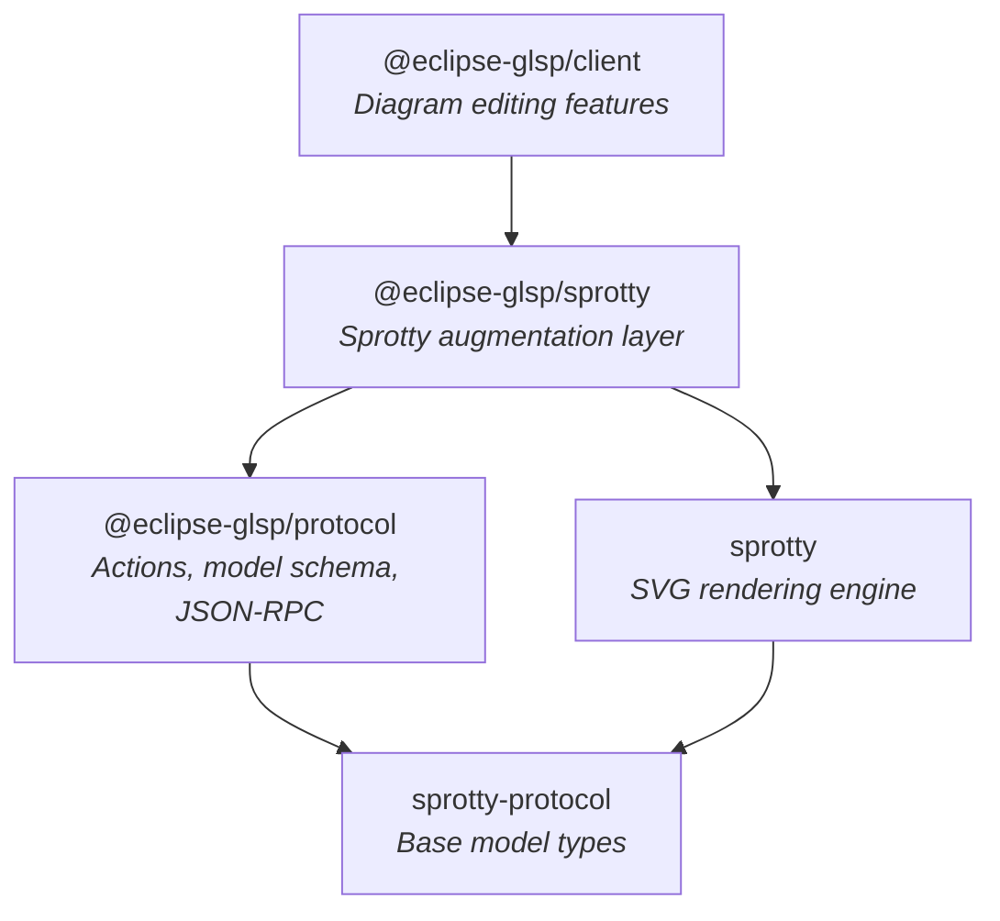
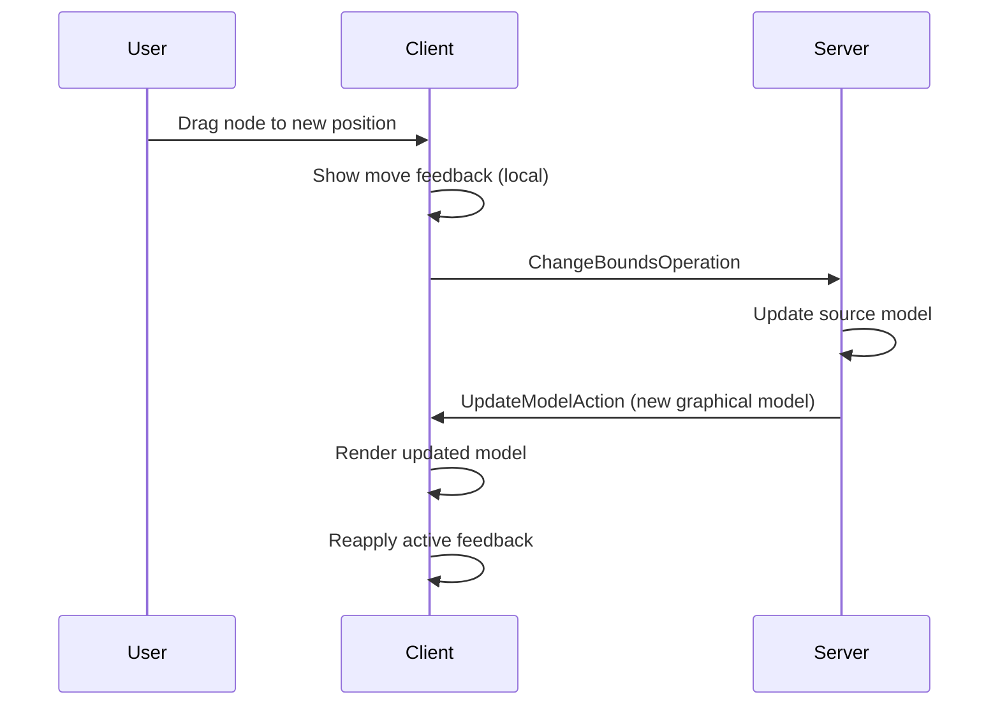
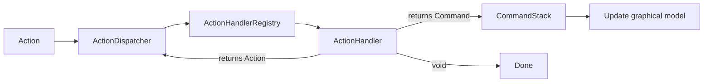
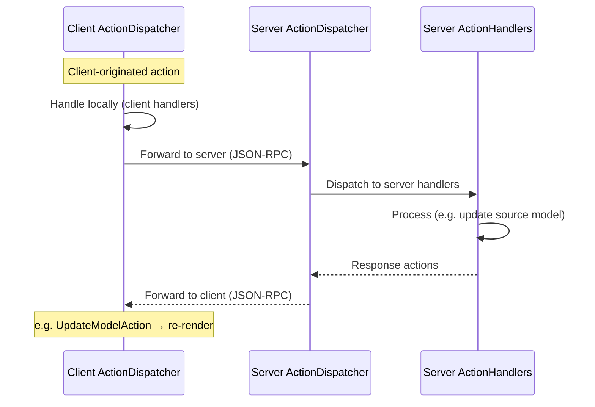

<!--
topic: architecture-overview
scope: architecture
related: []
last-updated: 2026-03-31
-->

# Architecture Overview

The GLSP client framework is a TypeScript-based diagram editor that renders and edits graphical models driven by a remote server. It builds on [sprotty](https://github.com/eclipse-sprotty/sprotty) for SVG rendering and [Inversify](https://inversify.io/) for dependency injection, adding server-driven model management, a rich editing tool system, and a protocol layer for client-server communication over JSON-RPC.

## Overview

The framework is organized as three npm packages with strict layering:



Each layer depends only on the layers below it. Application code imports from `@eclipse-glsp/client`, which re-exports everything from the lower packages. Direct imports from `sprotty` are discouraged — `@eclipse-glsp/sprotty` provides curated, GLSP-compatible re-exports.

## Core Concepts

### The Three Packages

#### `@eclipse-glsp/protocol` — Foundation

The protocol package is the lowest layer. It defines the **data types** that flow between client and server and provides the transport infrastructure to move them. It has no dependency on sprotty's rendering engine.

What it provides:
- **Action protocol** — Actions are the central message object in GLSP. All communication between client and server is expressed as actions — plain serializable objects with a `kind` string discriminator. The protocol defines the core action types organized by domain (model data, element creation, selection, clipboard, validation, navigation, etc.). These are specifically the actions that are interchanged between client and server; actions that are handled purely on the client or server side are not part of the protocol. Two specialized action subtypes are part of the core protocol:
  - **Request/Response actions** — `RequestAction`/`ResponseAction` pairs with correlation IDs. These can optionally be dispatched in a blocking fashion from the client side, allowing the caller to `await` the server's response.
  - **Operations** — Actions marked with `isOperation: true` that request a source model modification. Any action that triggers a change to the source model must be modeled as an `Operation`. Examples include `ChangeBoundsOperation`, `CreateNodeOperation`, and `ApplyLabelEditOperation`.
- **GModel schema types** — Serializable representations of the class-based graphical model used on the client side (`GModelRootSchema`, `GNodeSchema`, `GEdgeSchema`, etc.). This is the transfer format for interchanging the graphical model between client and server.
- **JSON-RPC transport** — The `GLSPClient` interface and its default implementation for WebSocket-based communication with the server.
- **DI primitives** — `FeatureModule` for modular DI composition with dependency tracking, `LazyInjector` for circular dependency resolution, and container configuration utilities.

#### `@eclipse-glsp/sprotty` — Bridge Layer

This package sits between protocol and client. It imports sprotty and re-exports it with GLSP-specific modifications:

- **G-prefix aliasing** — Sprotty's model classes are re-exported under GLSP names: `SNodeImpl` becomes `GNode`, `SEdgeImpl` becomes `GEdge`, `SGraphImpl` becomes `GGraph`, and so on. This signals that GLSP augments these types while maintaining sprotty compatibility.
- **API augmentation** — Sprotty interfaces (`IActionDispatcher`, `KeyListener`, `MouseListener`, etc.) are re-declared to use GLSP's `Action` type instead of sprotty's. This prevents type conflicts when both libraries define an `Action` type.
- **Feature module wrapping** — Sprotty's built-in modules are wrapped in `FeatureModule` instances so they participate in GLSP's dependency tracking.
- **Selective exclusion** — Features that GLSP replaces server-side (client-side element creation, undo-redo) are excluded from re-exports.

#### `@eclipse-glsp/client` — Application Layer

The client package implements the full diagram editing experience. It is organized into three main areas:

- **`base/`** — Core services like action dispatching, command execution, model loading, feedback management, tool management, and input handling.
- **`features/`** — Feature modules covering tools (node/edge creation, deletion, marquee selection), editing (label edit, change bounds, reconnect), navigation (search palette, command palette), validation (issue markers), accessibility (keyboard navigation), and visualization (grid, helper lines, viewport, z-order).
- **`views/`** — SVG view components for rendering GLSP model elements.

All features are packaged as `FeatureModule` instances and composed via `DEFAULT_MODULES`, which provides a complete out-of-the-box editor.

### Server-Driven Model

The defining architectural choice of GLSP is that the **server owns the source model**. The client never modifies the source model directly — every change to it must go through the server via operations.

The client does, however, maintain and modify its own graphical model for rendering purposes. Ephemeral visual state like selection highlights, move previews, and hover effects is applied directly to the client-side graphical model as feedback. This feedback is client-local and not persisted to the source model.



This means:
- **Model updates** arrive from the server as `SetModelAction` or `UpdateModelAction`. The client renders whatever the server sends.
- **Editing operations** are sent to the server as `Operation` actions. The server processes them and responds with an updated graphical model.
- **Undo/redo** is server-side. The client dispatches `UndoAction`/`RedoAction` to the server, which manages the undo/redo history on the source model.
- **Visual feedback** (selection highlights, move previews, hover effects) is applied to the client-side graphical model and reapplied after every server-driven model update.

### Action Handling

Actions are the universal communication primitive in GLSP. Every user interaction, server message, and internal event is expressed as an action. Both the client and server follow the same pattern: an `ActionDispatcher` receives actions and delegates them to registered `ActionHandler` instances based on the action's `kind`.

#### Client-Side Action Handling

When an action is dispatched on the client, the `ActionDispatcher` looks up matching handlers in the `ActionHandlerRegistry`. A handler processes the action and can optionally return a response — either another action (which is dispatched recursively) or a command (which modifies the client-side graphical model and triggers re-rendering).



Not all actions stay on the client. After local handling, the client decides whether to forward the action to the server. Actions that originated from the server are never forwarded back; all other actions are sent to the server for potential processing.

#### Client-Server Action Exchange

The server mirrors the client's action handling architecture. It has its own `ActionDispatcher` and `ActionHandlerRegistry`. When an action arrives from the client, the server dispatches it through its handler pipeline. For operations (model-modifying actions), the server updates the source model and responds with actions like `UpdateModelAction` that flow back to the client.



Some actions are handled exclusively on one side. For example, purely visual actions like hover feedback are handled only on the client, while source model persistence is handled only on the server. The protocol-defined actions are the ones that both sides understand and exchange.

### Dependency Injection

GLSP uses [Inversify](https://inversify.io/) for dependency injection. The framework extends Inversify with a `FeatureModule` abstraction that adds a unique identifier per module and the ability to declare dependencies between modules. This prevents duplicate loading and ensures modules are loaded in the right order.

Adopters configure the DI container through `initializeDiagramContainer`, which loads all default feature modules and then applies customizations. Modules can be added, removed, or replaced:

```typescript
const container = initializeDiagramContainer(
    new Container(),
    workflowDiagramModule,    // Custom module
    { remove: [hoverModule] } // Remove a default feature
);
```

This composition model lets adopters tailor the editor to their needs without forking the framework. The DI system and module patterns are covered in more depth in a dedicated document.

## How It Works

### Client-Server Communication

The transport layer uses JSON-RPC over WebSocket. The `GLSPClient` interface manages the connection lifecycle. Communication follows three phases:

1. **Server initialization** — The client sends its protocol version and application ID. The server responds with the action kinds it handles per diagram type.

2. **Session initialization** — The client registers a session with the server, providing the diagram type and the action kinds the client handles. This lets each side know which actions the other understands.

3. **Action messaging** — Once initialized, actions flow bidirectionally as `ActionMessage` objects. `GLSPModelSource` handles routing: client-originated actions go to the server; server-originated actions are dispatched locally but not forwarded back.

### From User Interaction to Model Update

A typical editing flow, like moving a node:

1. **Mouse event** — The active tool captures a drag gesture.
2. **Feedback** — The tool applies a move preview to the client-side graphical model. The node visually moves on screen immediately.
3. **Operation** — When the user releases the mouse, the tool dispatches a `ChangeBoundsOperation` containing the new bounds.
4. **Server routing** — `GLSPModelSource` forwards the operation to the server via JSON-RPC.
5. **Server processing** — The server applies the operation to the source model and sends back an `UpdateModelAction` with the new graphical model.
6. **Model update** — The client applies the new model and reapplies any active feedback.
7. **Rendering** — Sprotty's rendering pipeline diffs the old and new model and updates the SVG DOM.

## Design Rationale

GLSP's architecture is shaped by a few key choices that inform everything else.

The **server-driven model** keeps the client stateless with respect to the domain. The server can enforce business rules, compute layouts, run validations, and maintain consistency — the client focuses on rendering and interaction. The trade-off is that every model change requires a server round-trip, but the feedback system compensates by providing immediate visual response on the client side.

**Actions as the universal communication primitive** means there is a single dispatch mechanism for user interactions, server messages, and internal events. This simplifies the architecture and makes it extensible — new features are typically implemented as action handlers wired into modules, without changing the dispatch logic itself.

The **three-package layering** separates protocol concerns (reusable across languages and platforms) from rendering concerns (sprotty-specific) from editing features (GLSP-specific). The bridge layer insulates application code from direct sprotty API changes and resolves type conflicts. In practice, application code should import from `@eclipse-glsp/client`, which re-exports everything from the lower packages.

**Module-based DI composition** reflects the reality that diagram editors have many optional, interchangeable features. Adopters extend the framework by writing `FeatureModule` instances and composing them into the container. The G-prefix naming convention (`GNode`, `GEdge` instead of sprotty's `SNodeImpl`, `SEdgeImpl`) keeps the API clean and signals that these types carry GLSP-specific augmentations.

## Glossary

- **Action** — A plain serializable object with a `kind` string that represents an event, command, or request. The fundamental communication unit in GLSP.
- **Operation** — A subtype of Action that requests a source model modification. Any action that triggers a change to the source model must be modeled as an Operation.
- **GModel** — The graphical model tree (`GModelRoot` → `GNode`, `GEdge`, `GLabel`, etc.) that represents the diagram's visual structure. Serialized as GModel schema for transport between client and server.
- **Source Model** — The server-side domain model that the graphical model is derived from. Only modified through operations.
- **FeatureModule** — An Inversify `ContainerModule` extended with a unique ID and dependency declarations. The unit of composition for GLSP features.
- **Feedback** — Ephemeral, client-local visual state (selection highlights, move previews) applied to the graphical model and reapplied after server-driven model updates.
- **ServerAction** — An action received from the GLSP server, marked to prevent it from being forwarded back.
